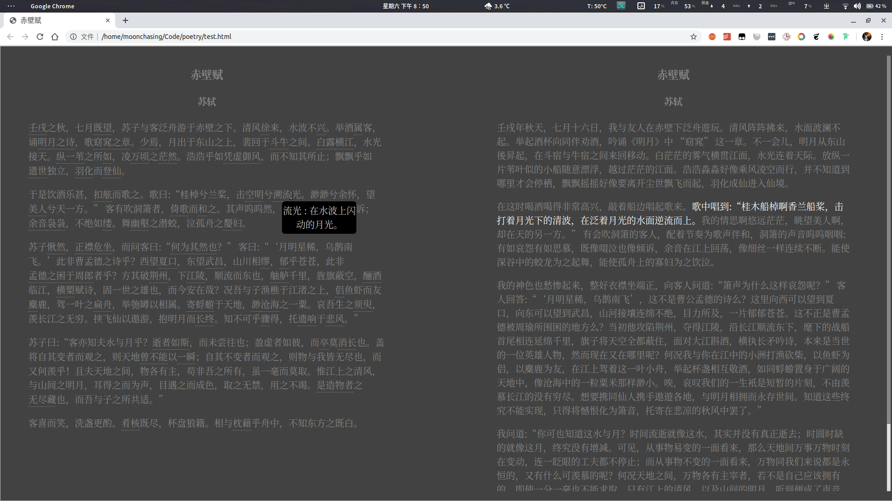

一直不太习惯古文和注释、译文分开的排版，及按此排版的阅读方式，个人而言不适有以下几点：

* 破坏阅读的流畅感。一会看注释标号，一会去后边按着标号查很麻烦。
* 破坏古诗文的结构美。一些整齐的对仗句结构被注释标号破坏，失去了原有的结构美。

1 月 7 日，正值 21 岁生日，在前往贵州找女友的高铁上阅读《东坡词傅幹注校证》一书时，突生想法，想自己搞个古文排版，特点如下

* 左边原文右边译文
* 译文随着原文滚动
* 有注释的以下划线标注，鼠标移过去显示注释
* 鼠标停留在句子上时高亮右边对应的译文

过往早有此想法，但未付诸行动，近日于女友家有些许闲暇，实现之。但因自己并不会前端，以故代码还很稚嫩，但已大致实现理想功能。

效果图如下：

ToDo：

- []  完善生成代码
- [] 诗文排版分类

效果预览：

